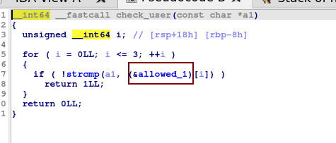
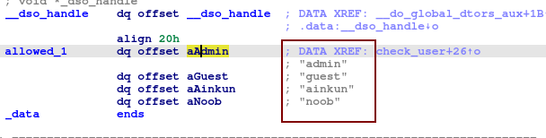
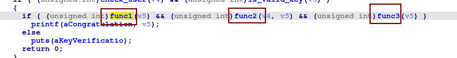
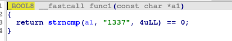
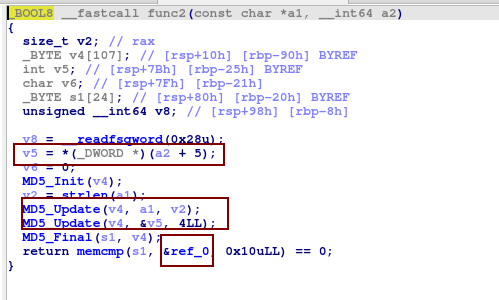
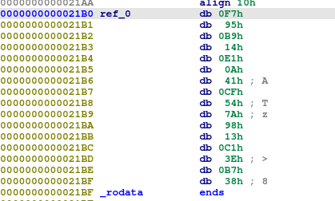
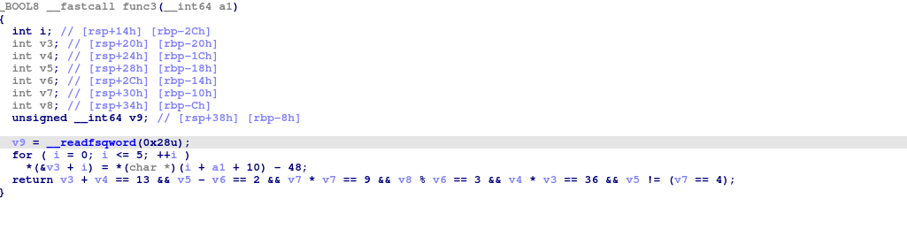

# Timed Vault

## Description

At 9:00 PM, a dusty old vault awakens, but only for 15 minutes. It’s protected by a secret username and a key—both hidden. The challenge? Get past the vault’s cryptic defenses before 9:15 PM, or the door slams shut until tomorrow. But what if the time check isn’t as solid as it seems?

**Difficulty:** *Medium*

## Attachments

- [Vault](./dist/Vault)

## Solution

While running the binary, it outputs:  
`Access denied: the vault can only be opened between 21:00 - 21:15 local time.`

Opening the binary with IDA shows that at the start of the execution flow, there is a function named `vault_access_time` which checks the local time. We can simply patch the binary or debug it to bypass this check.

After bypassing the time check and running the binary again, we get the output:  
`Usage: ./Vault <user> <NNNN-NNNN-NNNNNN>`

This indicates that the binary expects two arguments: a username and a stream of integers separated by hyphens (`-`).

Opening the binary again in IDA, we find a function named `check_user`, which takes the first argument (username). This function checks whether the username is present in the `allowed_1` list.

The allowed list contains four users: `admin`, `guest`, `ainkun`, and `noob`.

Next, the execution flow expects three functions to return `True`:
- `func1`
- `func2`
- `func3`

---

### func1: Checking the First Part
The first function, `func1`, takes the second argument and checks if the first 4 digits of the number stream are equal to `1337`.

---

### func2: Verifying with an MD5 Hash
The second function, `func2`, takes both arguments and combines the username with the middle 4 digits, then computes the MD5 hash. This hash is compared against a hardcoded value.

To find the correct middle 4 digits, you can write a simple script to brute-force all 4-digit combinations for each username and compare the resulting hash with the hardcoded hash.

---

### func3: Solving Constraints for the Last Part
The third function, `func3`, takes the second argument and performs constraint checks on each digit of the third part of the number stream.

To solve this, you can write a simple `z3` script that finds all number combinations satisfying the given constraints.

You can find the solving script here: [sol.py](sol.py)

Flag: *`flag{1337-8723-497538}`*

---

### **Note:**
The intended last 6 digits were `497538`, but due to improper sanitization of the constraints in the binary, the script generated **14 different numbers**, all of which satisfy the checks.

Special thanks to **[Hasan Faraz](https://github.com/hexamine22)** for pointing out the flaw and providing the solving script.

